3D RNA-seq App
==============
  <i><h4>"Easy-to-use" user manual</h4></i>
  <i><h4>Wenbin Guo</h4></i>
  <i><h4>10 December 2019</h4></i>
  <i><h4>Information & Computational Sciences, James Hutton Institute, Dundee DD2 5DA, UK</h4></i>
  
  
-   [License](#license)
-   [Citation](#citation)
-   [Demo video](#demo-video)
-   [Introduction](#introduction)
-   [How to get help](#how-to-get-help)
    -   [User manuals](#user-manuals)
    -   [Tooltips](#tooltips)
    -   [Contact us](#contact-us)
-   [Run 3D RNA-seq App](#run-3d-rna-seq-app)
    -   [Shiny docker image (no
        installation)](#shiny-docker-image-no-installation)
    -   [Shiny App through RStudio (R users, installation
        required)](#shiny-app-through-rstudio-r-users-installation-required)
    -   [R command line (advanced R users, installation
        required)](#r-command-line-advanced-r-users-installation-required)
-   [Input files](#input-files)
-   [Output files](#output-files)
-   [Example data](#example-data)
-   [Run analysis on 3D App](#run-analysis-on-3d-app)
    -   [Basic Workflow](#basic-workflow)
    -   [Tab panel 1: Data generation](#tab-panel-1-data-generation)
    -   [Tab panel 2: Data
        pre-processing](#tab-panel-2-data-pre-processing)
    -   [Tab panel 3: 3D analysis](#tab-panel-3-3d-analysis)
    -   [Tab panel 4: Time-series trend
        analysis](#tab-panel-4-time-series-trend-analysis)
    -   [Tab panel 5: Functional plot](#tab-panel-5-functional-plot)
    -   [Tab panel 6: Isoform switch](#tab-panel-6-isoform-switch)
    -   [Tab panel 7: Generate report](#tab-panel-7-generate-report)
-   [Appendix](#appendix)
    -   [Files in report folder](#files-in-report-folder)
    -   [Files in figure folder](#files-in-figure-folder)
    -   [Files in result folder](#files-in-result-folder)
    -   [Files in data folder](#files-in-data-folder)
-   [References](#references)
-   [Session information](#session-information)

<div align="justify">
<p id='table-of-contents'>

License
-------

3D RNA-seq is currently under a dual-licensing model.

-   Open source under GPLV3.0. For academic and non-commercial use, it
    is free.
-   Commercial. For commercial use, please get in touch to obtain
    commercial licenses. <a href="#how-to-get-help">Contact us</a>

Citation
--------

To use our pipeline in your work, please cite:

-   Guo,W., Tzioutziou,N., Stephen,G., Milne,I., Calixto,C., Waugh,R.,
    Brown,J.W., and Zhang,R. (2019) 3D RNA-seq - a powerful and flexible
    tool for rapid and accurate differential expression and alternative
    splicing analysis of RNA-seq data for biologists. bioRxiv, 656686.
    doi:
    <a href="https://doi.org/10.1101/656686" class="uri">https://doi.org/10.1101/656686</a>.
-   Calixto,C.P.G., Guo,W., James,A.B., Tzioutziou,N.A., Entizne,J.C.,
    Panter,P.E., Knight,H., Nimmo,H.G., Zhang,R., and
    Brown,J.W.S. (2018) Rapid and Dynamic Alternative Splicing Impacts
    the Arabidopsis Cold Response Transcriptome. Plant Cell, 30,
    1424–1444.

Demo video
----------

To watch a demo video, click the screenshot

<a href='https://youtu.be/rqeXECX1-T4' target='_blank'>https://youtu.be/rqeXECX1-T4</a>

<a href="https://youtu.be/rqeXECX1-T4" target="_blank"></a>

<hr>

Introduction
------------

The ThreeDRNAseq (3D RNA-seq) R package is designed for use by
biologists to analyze their own RNA-seq data (Guo et al., 2019). It
provides an interactive graphical user interface (GUI) for differential
expression (DE), differential alternative splicing (DAS) and
differential transcript usage (DTU) (3D) and changes of time-series
trend analyses of RNA-seq data based on the popular pipeline limma
(Ritchie et al., 2015). It also integrated transcript isoform switch
tools, such as IsoKtsp (Sebestyen et al., 2015) and TSIS (Guo et al.,
2017) for an enhanced alternative splicing analysis. The 3D RNA-seq
removes all the unnecessary complexities associated with differential
expression analysis and enables a complete RNA-seq analysis to be done
quickly (3 Days, thus 3D). It allows complex experimental designs such
as time-series, developmental series and multiple conditions. It employs
state-of-the-art methods/statistics and generates 3D results quickly and
accurately.

<br> The 3D RNA-seq App was developed by Dr. Wenbin Guo from research
into the analysis of time-series RNA-seq data (Calixto et al., 2018)
with help from Dr. Cristiane Calixto and Dr. Nikoleta Tzioutziou and
guidance from Prof. John W.S. Brown and Dr. Runxuan Zhang from the
University of Dundee - School of Life Sciences and the James Hutton
Institute - Information and Computational Sciences. We acknowledge
Dr. Iain Milne and Gordon Stephen for technical support.

**3D analysis pipeline**


<a href='#table-of-contents'>Go back to Table of contents</a>

How to get help
---------------

### User manuals

3D RNA-seq App “easy-to-use” manual:

<a href="https://github.com/wyguo/ThreeDRNAseq/blob/master/vignettes/user_manuals/3D_RNA-seq_App_manual.md" target="_blank">https://github.com/wyguo/ThreeDRNAseq/blob/master/vignettes/user\_manuals/3D\_RNA-seq\_App\_manual.md</a>

### Tooltips

In the GUI, users can click tooltips
 in specific
steps for help information.

### Contact us

3D RNA-seq App is developed and maintained by Dr. Wenbin Guo from the
Plant Sciences Division, School of Life Sciences, University of Dundee.
If you have any questions and suggestions, please contact:

-   Dr. Wenbin Guo:
    <a href="mailto:wenbin.guo@hutton.ac.uk" class="email">wenbin.guo@hutton.ac.uk</a>
-   Dr. Runxuan Zhang:
    <a href="mailto:runxuan.zhang@hutton.ac.uk" class="email">runxuan.zhang@hutton.ac.uk</a>

<a href='#table-of-contents'>Go back to Table of contents</a>

Run 3D RNA-seq App
------------------

### Shiny docker image (no installation)

The 3D RNA-seq App docker image is hosted by the James Hutton Institute
server. Open the App by this link:
<a href="https://ics.hutton.ac.uk/3drnaseq" target="_blank">https://ics.hutton.ac.uk/3drnaseq
</a>

-   To perform 3D analysis, no installation is required. Users need to
    upload input data to our server. All results, reports, figures and
    intermediate data will be zipped and downloaded in the final step.
-   If you are working on RNA-seq data with very big size of transcript
    quantification (≥ 2GB), it is recommended to remove the redundant
    files in the Salmon/Kallisto outputs (see
    <a href='#input-files'>Input files</a>) to reduce data size or run
    the 3D RNA-seq App through RStudio on a local PC.

### Shiny App through RStudio (R users, installation required)

To run the 3D RNA-seq App through RStudio on a local PC, users do not
need to upload the data to our server and all the outputs will be
directly saved to the App working directory. Please run the following
command to install ThreeDRNAseq R package and the packages of
dependencies. If any other R packages are missing in your PC, please
install them.

***Install dependency packages***

``` r
#####################################################################################
## Install packages of dependency
###---> Install packages from Cran
cran.package.list <- c("shiny","shinydashboard","rhandsontable","shinyFiles",
                       "shinyjs","shinyBS","shinyhelper","shinyWidgets",
                       "magrittr","DT","plotly","ggplot2","eulerr",
                       "gridExtra","grid","fastcluster","rmarkdown",
                       "ggrepel","zoo","gtools")
for(i in cran.package.list){
   if(!(i %in% rownames(installed.packages()))){
     message('Installing package: ',i)
     install.packages(i)
   } else next
}

###---> Install packages from Bioconductor
bioconductor.package.list <- c('tximport','edgeR','limma','RUVSeq',
                               'ComplexHeatmap','rhdf5')
for(i in bioconductor.package.list){
  if (!requireNamespace("BiocManager", quietly = TRUE))
    install.packages("BiocManager")
  if(!(i %in% rownames(installed.packages()))){
    message('Installing package: ',i)
    BiocManager::install(i)
  } else next
}
```

***Install ThreeDRNAseq R package***

ThreeDRNAseq R package can be installed from Github by using
<a href='https://cran.r-project.org/web/packages/devtools/index.html' target='_blank'>devtools</a>
R package

``` r
##################################################################################################
## use devtools R package to install ThreeDRNAseq from Github
###---> If devtools is not installed, please install
if(!requireNamespace("devtools", quietly = TRUE))
  install.packages('devtools',dependencies = TRUE)

###---> Install ThreeDRNAseq
if(!requireNamespace("ThreeDRNAseq", quietly = TRUE))
  devtools::install_github('wyguo/ThreeDRNAseq')
```

***Run 3D RNA-seq App***

``` r
library(ThreeDRNAseq)
run3DApp()
```

### R command line (advanced R users, installation required)

The ThreeDRNAseq R package can be used as a normal R package. The
vignette of command line for 3D analysis can be found in:

<a href="https://github.com/wyguo/ThreeDRNAseq/blob/master/vignettes/user_manuals/3D_RNA-seq_command_line_user_manual.md" target="_blank">https://github.com/wyguo/ThreeDRNAseq/blob/master/vignettes/user\_manuals/3D\_RNA-seq\_command\_line\_user\_manual.md</a>

<a href='#table-of-contents'>Go back to Table of contents</a>

Input files
-----------

1.  Gather the meta-data of the experimental design in a csv
    spreadsheet, the columns of which must include the following
    information (<a href='#fig_input_csv'>Figure 1A</a>):

    -   The first row is the header line of the meta-data table.
    -   A column of the factors or multiple columns of the factors of
        the experimental design.
    -   A column of the biological replicate labels.
    -   A column of the sequencing/technical replicate labels if they
        exist.
    -   A column of the file names of transcript quantifications.

    **Note:** In the 3D RNA-seq analysis, users can select the
    experimental design information according to the column names in the
    header line.

2.  A folder that contains the transcript quantification files. Each
    file contains transcript quantification data of a single sample.
    Read counts and TPMs for 3D analysis will be generated from
    (<a href='#fig_input_csv'>Figure 1B</a>):

    -   The “quant.sf” objects if these files are generated by Salmon
        command line (Patro et al., 2017).
    -   The “abundance.tsv” objects if these files are generated by
        Kallisto (Bray et al., 2016).
    -   The “xxx.tabular” objects with file extension “.tabular” if
        these files are generated by Salmon/Kallisto with Galaxy
        interface. Please go to the “Transcript quantification using
        Galaxy” manual for details:
        <a href=' https://github.com/wyguo/ThreeDRNAseq/blob/master/vignettes/user_manuals/Transcript_quantification_using_Galaxy.md' target='_blank'>https://github.com/wyguo/ThreeDRNAseq/blob/master/vignettes/user\_manuals/Transcript\_quantification\_using\_Galaxy.md</a>

    **Note**: The 3D analysis is executable in a computer with normal
    memory and CPU size. If the App is running on our server, it is
    recommended to reduce the data size to upload. Users can exclude all
    the files in sub-folders of transcript quantifications, except the
    files of “quant.sf” from Salmon command line. If the transcript
    quantifications are generated using Kallisto command line, users can
    keep “abundance.tsv” in the sub-folders and remove the other files
    (<a href='#fig_input_csv'>Figure 1B</a>).

3.  Transcript-gene association table. The file can be one of the
    following formats:

    

    -   “csv” spreadsheet with first column of transcript IDs and second
        column of gene IDs (<a href='#fig_input_csv'>Figure 1C</a>)
        (recommended).
    -   Or the transcriptome sequence “fasta” file that has been used
        for transcript quantification with Salmon/Kallisto. Transcript
        names and gene IDs will be extracted the description line
        starting with “\>” in the “fasta” file. However, if the “gene”
        tag in the description line is missing, this file is invalid
        (<a href='#fig_input_csv'>Figure 1D</a>).
    -   Or a “gtf” file of the transcriptome. Transcript names and gene
        IDs will be extracted from the “transcript\_id” and “gene\_id”
        tags in the last column, respectively
        (<a href='#fig_input_csv'>Figure 1E</a>).

    **Note**: **Transcript-gene mapping in “csv” file is recommended**.
    Depending on the size, it may take a while to generate the table
    from a “fasta” or a “gtf” file and any missing tags for transcript
    name and gene ID extraction in these files may lead to errors.


<p id="fig_input_csv">
<strong>Figure 1:</strong> Input files of 3D RNA-seq App. The example is
from a RNA-seq study of Arabidopsis in respond to cold (Calixto et al.,
2018). (A) Meta-data table of sample information in csv file. (B) The
folder contains transcript quantifications. The input of transcript-gene
mapping information can be a “csv” spreadsheet with first column of
transcript names and second column of gene IDs (C), a “.fa” file (D) or
a “.gtf” file (E) of the transcriptome. If a “.fa” or a “.gtf” file is
provided, the App will extract transcript-gene association information
with specific tags.
</p>

<a href='#table-of-contents'>Go back to Table of contents</a>

Output files
------------

The results of the 3D RNA-seq analysis are saved in the App working
directory in four folders:

1.  “report” folder: the final report in html, pdf and word formats will
    be saved in the “report” folder.
2.  “result” folder: the gene lists generated from DE, DAS and DTU
    analysis will be saved as csv files in the “result” folder.
3.  “figure” folder: the figures generated and saves through the
    analysis will be saved in the “figure” folder.
4.  “data” folder: the intermediate datasets of the analysis will be
    saved in the “data” folder in R data format (.RData). R users can
    open and process these objects in R software for a further
    personalized analysis. The detailed descriptions of saved files can
    be found in “Appendix” at the end of the document.

Example data
------------

**Download link**:
<a href='https://www.dropbox.com/s/8vwuz6u2yl7v9qx/3D%20RNA-seq%20App%20example%20data.zip?dl=0' target='_blank'>https://www.dropbox.com/s/8fsceneq8jlegwi/3D\_RNAseq\_example\_data.zip?dl=0</a>

**Description**: This example is a sub-dataset from a time-series study
of Arabidopsis plants exposed to cold (Calixto et al., 2018). RNA-seq
data of 6 time-points were extracted from the whole dataset. The
time-points are 3 and 6 hours after dusk at 20<sup>*o*</sup>*C*, the
first day of transition to 4<sup>*o*</sup>*C* and the fourth day of
acclimation to 4<sup>*o*</sup>*C* (red boxes in Figure 2). Each
time-point has 3 biological replicates and each biological replicate has
3 sequencing replicates. Transcript quantifications were generated using
Salmon (Patro et al., 2017) and AtRTD2-QUASI (Zhang et al., 2017) as the
reference transcriptome. To further reduce the data size, the expression
of 8,944 transcripts (from 2,000 genes) were extracted from the Salmon
quantification to identify the cold response genes and transcripts at
both transcriptional and AS level.


<p id="fig_example_exp">
<strong>Figure 2:</strong> Experimental design of time-series RNA-seq
data from study of Arabidopsis cold response. For this example, a subset
of samples, genes and transcripts were extracted from the whole dataset
to reduce data size.
</p>

<a href='#table-of-contents'>Go back to Table of contents</a>

Run analysis on 3D App
----------------------

### Basic Workflow

3D RNA-seq App is made of control widgets that users can interact with
and send messages to the underlying R code to perform analysis by simple
clicking/dragging of the mouse (<a href='#fig_basic_structure'>Figure
3</a>).


<p id='fig_basic_structure.png'>

<strong>Figure 3:</strong> Basic widgets of 3D RNA-seq App. </a>

Running 3D RNA-seq just requires users to follow the steps from Tab
panel 1 to 7.

### Tab panel 1: Data generation

Users can upload input files and experimental design metadata file in
this tab panel. Transcript level and gene level read counts and TPMs
(transcript per million reads) are generated by using the tximport R
package (Soneson et al., 2016).

<u><strong>Step 1: Upload input files to 3D RNA-seq App.</strong></u>

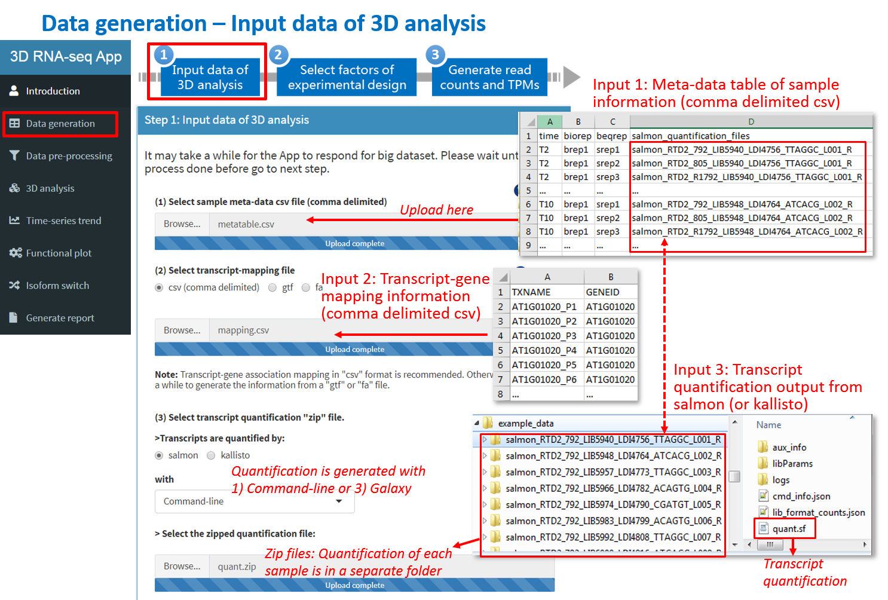

<br> <u><strong>Step 2: Select the columns of factors, labels of
replicates and quantification file names from meta-data table for 3D
analysis.</strong></u>

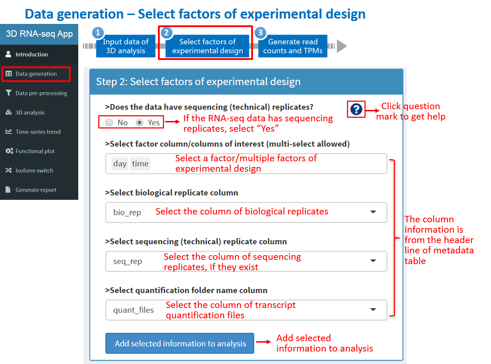

<br> <u><strong>Step 3: Generate gene and transcript read counts and
TPMs.</strong></u>


When the button “Run” is clicked, the process currently running will be
shown at the lower right corner of the web browser. Once it is done, you
can move to Tab panel 2 using the navigation menu on the left and make
sure you roll your page to the very top.

<a href='#table-of-contents'>Go back to Table of contents</a>

### Tab panel 2: Data pre-processing

Once the read counts and TPMs are generated, the data will go through a
number of pre-processing steps. In each step, quality control plots are
generated to optimise the parameters for pre-processing. If the RNA-seq
data has sequencing replicates (seq-reps), they will be merged before 3D
analysis according to the seq-rep labels selected by users in the
meta-data table to increase sequencing depth, because seq-reps are
generated by sequencing the same biological replicate multiple times
(e.g. on different sequencing lanes), but they do not add much
variability to the biological replicates.

<u><strong>Step 4: Filter low expressed transcripts and genes based on
expression mean-variance trend.</u></strong>


<br> <u><strong>Step 5: PCA plot and removing batch
effects.</u></strong>

The PCA plot can be used to visualise the main variations of the
expression data and identify whether the RNA-seq data contains batch
effects, which are caused by biological replications being prepared in
different, for example, laboratory conditions

In this panel, users can select and visualise different PCs based on
transcript level or gene level expression of all samples or the average
expression of biological replicates. The scatter points can be grouped
and coloured according to different factors. Ellipses or polygons can be
added to the plots to highlight the grouped clusters.

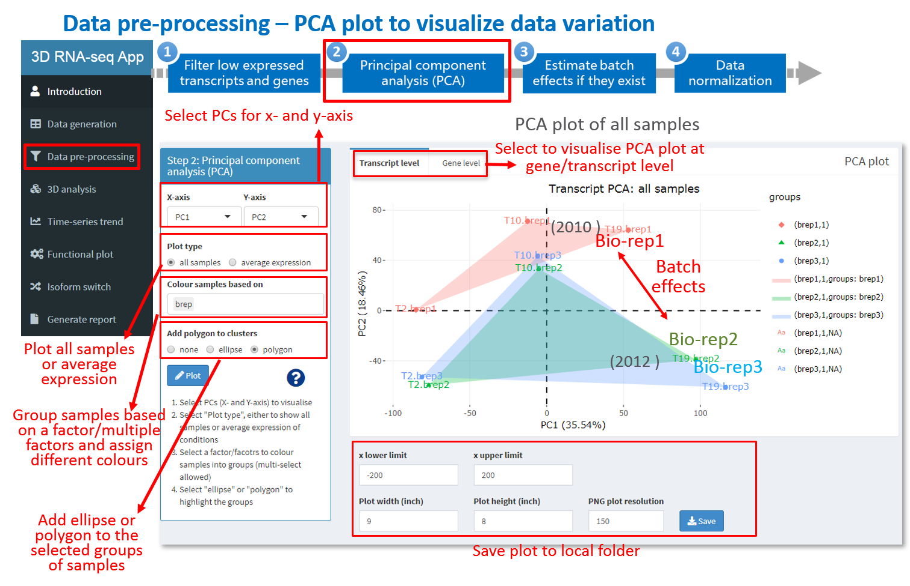
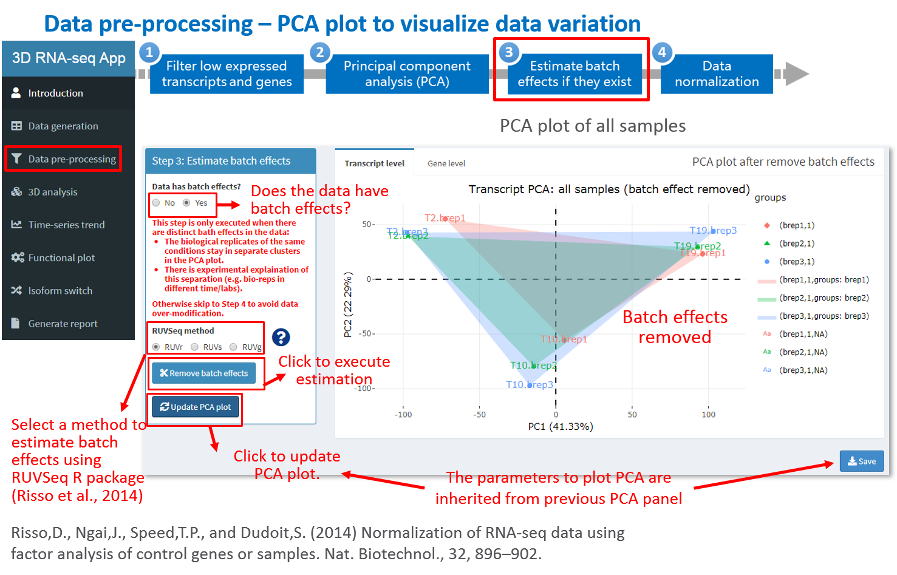

<u><strong>Step 6: Data normalisation.</u></strong>

For unbiased comparisons across samples, read counts must be normalised.
Normalisation methods such as Trimmed Mean of M-values (TMM), Relative
Log Expression (RLE) and upper-quartile can be used to reduce the effect
from the systematic technical biases across samples (Bullard et al.,
2010). Box plots are used to visualise the expression distribution of
raw read counts and normalised expression across samples.


Once the normalization is done as shown at the lower right corner on the
browser, please proceed to Tab panel 3.

<a href='#table-of-contents'>Go back to Table of contents</a>

### Tab panel 3: 3D analysis

<u><strong>Step 7: Set contrast groups and perform 3D
analysis.</u></strong>

A contrast group is a user-defined comparison between two samples or two
groups of samples:

1.  Pair-wise comparison of samples: e.g. B-A compares group B to group
    A; C-B compares group C to group B (Figure A).
2.  Compare mean of multiple samples: e.g. (WT.A+WT.B)/2-(MU.A+MU.B)/2
    compares the mean of group WT.A and WT.B to the mean of group MU.A
    and MU.B (Figure B).
3.  Compare difference of two differences (interactions):
    e.g. (WT.A-WT.B)-(MU.A-MU.B) compares the difference
    (*L*<sub>2</sub>*F**C*) of group WT.A and WT.B to the difference
    (*L*<sub>2</sub>*F**C*) of group MU.A and MU.B (Figure B).

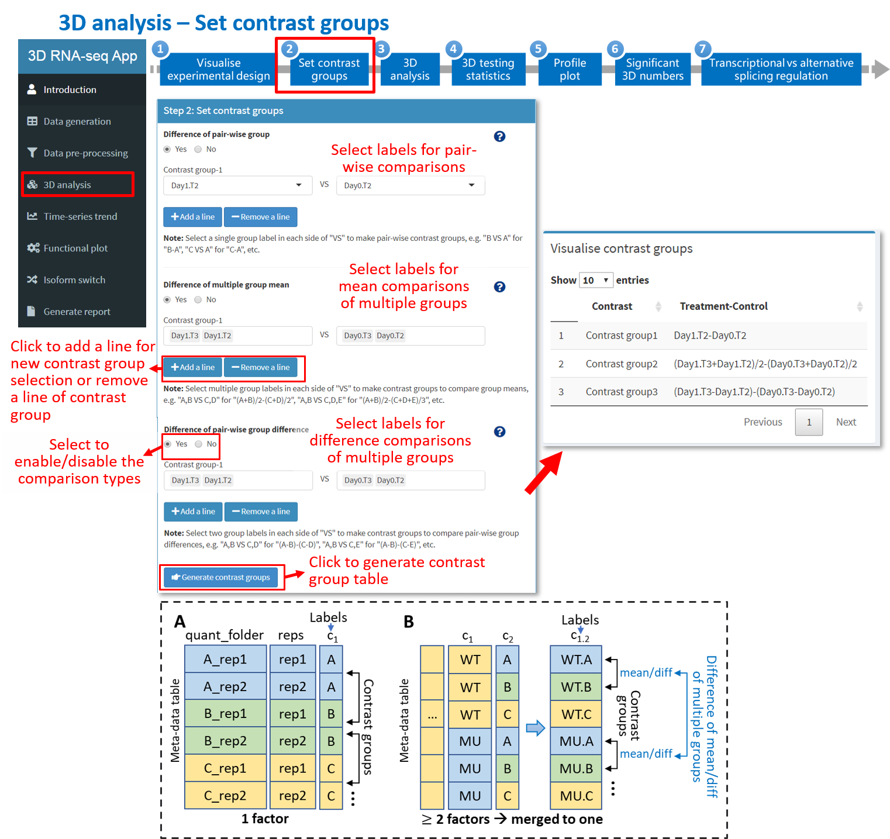

**NOTE**: if the experimental design involves multiple factor levels,
e.g. condition A, B and C are performed in wildtype (WT) and mutant
(MU), respectively, these factors will be combined to generate group
labels

<br> <u><strong>Step 8: Set statistical parameters and perform 3D
analysis </u></strong>


**Significant result summary**

After the the 3D analysis, the following information is summarized and
will appear at the bottom of the page:

1.  The test statistics in different contrast groups, e.g. adjusted
    p-value and *L*<sub>2</sub>*F**C*.
2.  The number of genes and transcripts with significant expression
    changes in contrast groups.
3.  The number of up- and down-regulated DE genes and transcripts.
4.  The numbers of genes/transcripts regulated only by transcription
    (DE), only by alternative splicing (DAS/DTU) and by both
    transcription and alternative splicing (DE+DAS/DE+DTU).

These summaries can be filtered, customized and the figures can be
generated and saved with specified formats and sizes.

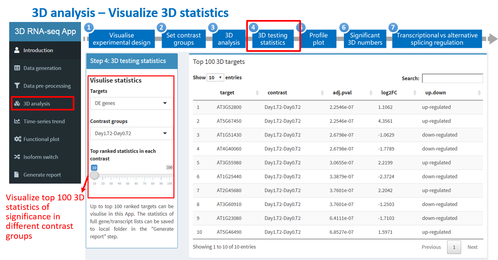

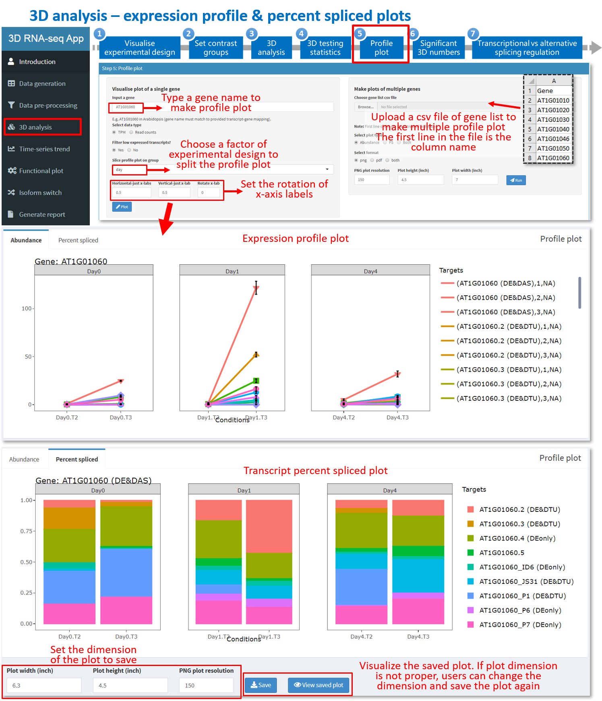


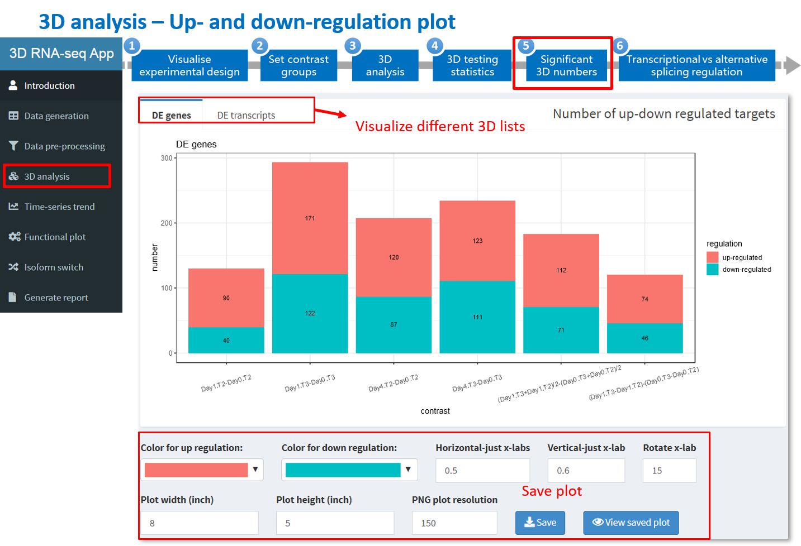

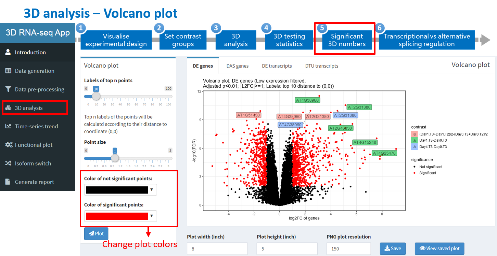


<a href='#table-of-contents'>Go back to Table of contents</a>

### Tab panel 4: Time-series trend analysis

Time-series trend analysis aims to study an experiment with many
time-points in each group (see the following table). When there are many
time-points, it is recommended to analyse on smoothed expression changes
over time instead of discrete comparisons of individual time-points in
each group.

| Day  | Time |
|------|------|
| Day1 | T1   |
| Day1 | T2   |
| Day1 | T3   |
| Day1 | T4   |
| Day2 | T1   |
| Day2 | T2   |
| Day2 | T3   |
| Day2 | T4   |

<u><strong>Step 9: Whether to perform time-series trend
analysis.</u></strong>

Select whether to perform time-series trend analysis. If “No”, please
skip this panel.

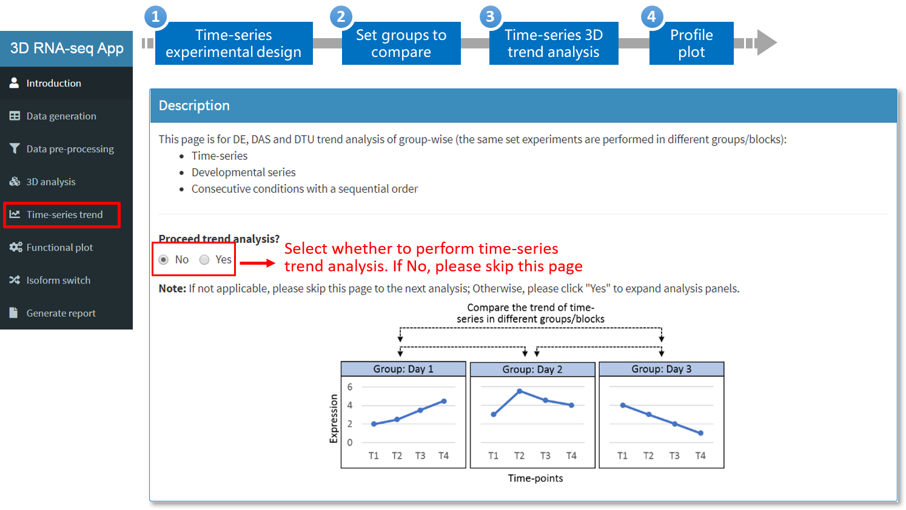

<u><strong>Step 10: Time-series experimental design.</u></strong>

1.  Select the columns of time-points and grouping of time-points
    according to the header information of the metadata table.
2.  Select whether to use spline method to smooth the expression changes
    over time-points and the degree to use for the spline
    (<a href='https://en.wikipedia.org/wiki/Spline_(mathematics)' target='_blank'><a href="https://en.wikipedia.org/wiki/Spline_(mathematics)" class="uri">https://en.wikipedia.org/wiki/Spline_(mathematics)</a>\></a>).
    . If “No” is selected, trend will be compared in the way of discrete
    jumping from one to another time-point in each group.


<u><strong>Step 11: Set groups to compare </u></strong>

Select multiple groups for comparisons of time-series expression change
trends between these groups. User can add a line to activate a new
comparison.

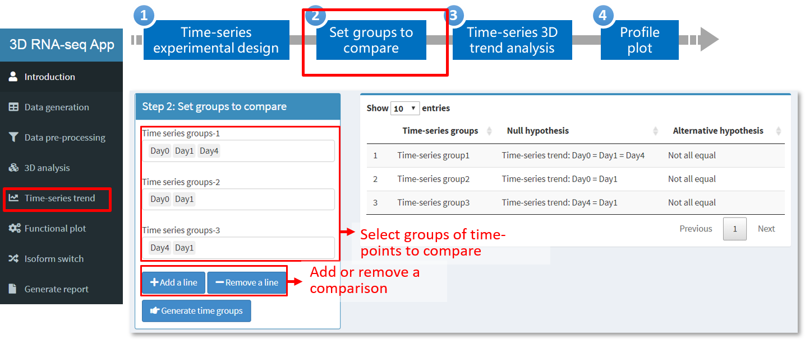

<u><strong>Step 12: 3D analysis of time-series trend </u></strong>

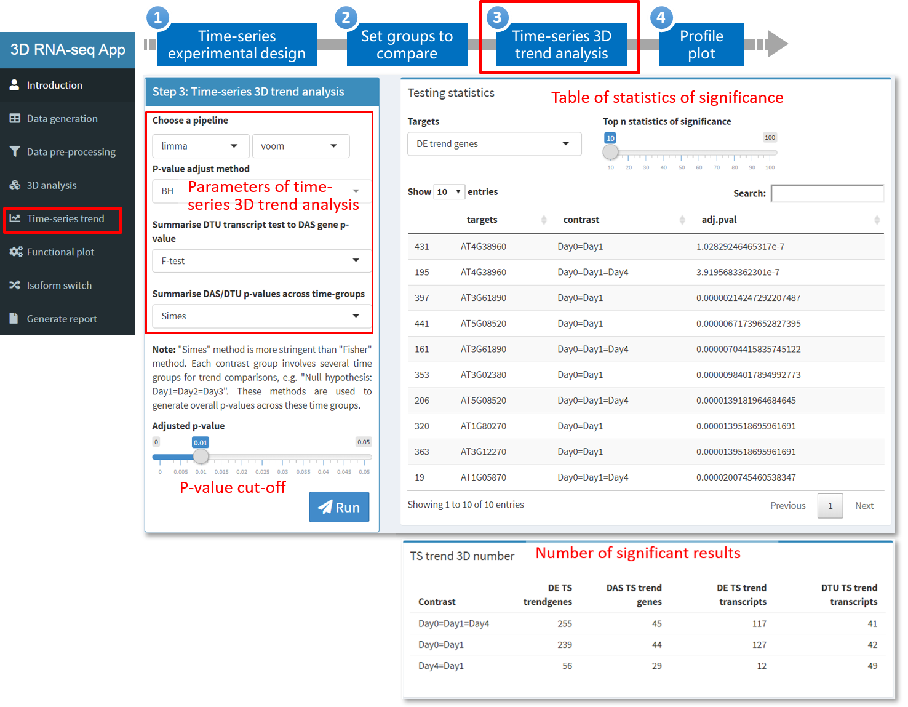

<a href='#table-of-contents'>Go back to Table of contents</a>

### Tab panel 5: Functional plot

<u><strong>Step 13: Generating heat-maps.</u></strong>

Users can make heat-maps of significant DE genes, DAS genes, DE
transcripts and DTU transcripts identified from the analysis. The
heat-maps and the gene/transcript list in each cluster of the heat-maps
can be saved to local folder.


<br>

<u><strong>Step 14: Generating GO enrichment plot.</u></strong>

Users can generate gene lists of DE genes, DAS genes, DE transcripts and
DTU transcripts by clicking “Download gene list” button. These gene
lists can be uploaded to Gene Ontology (GO) analysis tools/databases
(e.g. DAVID and agriGO) to generate GO annotation. A csv file with GO
annotation information is required to generate the annotation plot. The
file includes a column of “Category” of CC (cellular component), BP
(biological process) and MF (molecular function), a column of “Term” of
GO annotation and the rest columns of statistics to report the
annotation enrichment, e.g. count, -log10(FDR), etc.


<a href='#table-of-contents'>Go back to Table of contents</a>

### Tab panel 6: Isoform switch

Transcript isoform switches (ISs) occur when within a gen a pair of
alternatively spliced isoforms reverse the order of their relative
expression levels. **IsokTSP** is a method to detect transcript ISs
between pair-wise conditions (Sebestyen et al., 2015) while **TSIS**
(time-series IS) is used to identify ISs in time-series data (Guo et
al., 2017).


<br> <u><strong>Step 15: Perform isoform switch analysis.</u></strong>

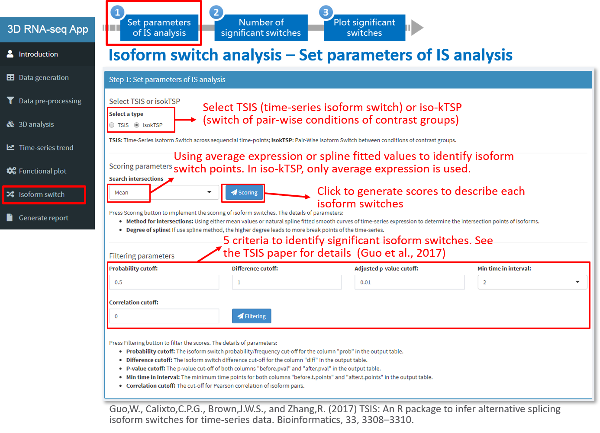

<br> After the analysis is done, a number of plots will be generated
automatically to visualize the results.


### Tab panel 7: Generate report

<u><strong>Step 16: generate report and download all the
results.</u></strong>

Publication-quality reports will generated and together with figures,
results and statistics of significance can be downloaded in a zipped
file.


<a href='#table-of-contents'>Go back to Table of contents</a>

Appendix
--------

<p id='supplementary_materials'>

### Files in report folder

Reports are saved in report folder.

| File name               | Description                                       |
|-------------------------|---------------------------------------------------|
| 3D\_report.pdf/html/doc | Report of 3D analysis in pdf, html and doc format |

### Files in figure folder

<table>
<colgroup>
<col style="width: 43%" />
<col style="width: 56%" />
</colgroup>
<thead>
<tr class="header">
<th>File names (alphabetical)</th>
<th>Description</th>
</tr>
</thead>
<tbody>
<tr class="odd">
<td>DAS genes euler plot across contrast*.pdf/.png</td>
<td>Euler diagram to compare DAS genes in different contrast groups</td>
</tr>
<tr class="even">
<td>DAS genes GO annotation plot.pdf/.png</td>
<td>DAS genes GO annotation plot</td>
</tr>
<tr class="odd">
<td>DE genes euler plot across contrast*.pdf/.png</td>
<td>Euler diagram to compare DE genes in different contrast groups</td>
</tr>
<tr class="even">
<td>DE genes GO annotation plot.pdf/.png</td>
<td>DE genes GO annotation plot</td>
</tr>
<tr class="odd">
<td>DE genes up and down regulation numbers.pdf/.png</td>
<td>DE genes up and down regulation numbers</td>
</tr>
<tr class="even">
<td>DE transcripts euler plot across contrast*.pdf/.png</td>
<td>Euler diagram to compare DE transcripts in different contrast groups</td>
</tr>
<tr class="odd">
<td>DE transcripts up and down regulation numbers.pdf/.png</td>
<td>DE transcripts up and down regulation numbers</td>
</tr>
<tr class="even">
<td>DE vs DAS gene euler plot in contrast*.pdf/.png</td>
<td>Euler diagram to compare DE and DAS genes in different contrast groups</td>
</tr>
<tr class="odd">
<td>DE vs DTU transcript euler plot in contrast*.pdf/.png</td>
<td>Euler diagram to compare DE and DTU transcripts in different contrast groups</td>
</tr>
<tr class="even">
<td>DTU transcripts euler plot across contrast*.pdf/.png</td>
<td>Euler diagram to compare DTU transcripts in different contrast groups</td>
</tr>
<tr class="odd">
<td>Gene expression distribution.pdf/.png</td>
<td>Gene expression distribution</td>
</tr>
<tr class="even">
<td>Gene mean-variance trend.pdf/.png</td>
<td>Gene mean-variance trend plot</td>
</tr>
<tr class="odd">
<td>Gene PCA all samples*.pdf/.png</td>
<td>Gene PCA plot of all samples</td>
</tr>
<tr class="even">
<td>Gene PCA average expression.pdf/.png</td>
<td>Gene PCA plot of average expression</td>
</tr>
<tr class="odd">
<td>Gene PCA batch effect removed all samples*.pdf/.png</td>
<td>Gene PCA plot of all samples after removing batch effects</td>
</tr>
<tr class="even">
<td>Heatmap DAS genes.pdf/.png</td>
<td>Heat-map of DAS genes</td>
</tr>
<tr class="odd">
<td>Heatmap DE genes.pdf/.png</td>
<td>Heat-map of DE genes</td>
</tr>
<tr class="even">
<td>Heatmap DE transcripts.pdf/.png</td>
<td>Heat-map of DE transcripts</td>
</tr>
<tr class="odd">
<td>Heatmap DTU transcripts.pdf/.png</td>
<td>Heat-map of DTU transcripts</td>
</tr>
<tr class="even">
<td>Isoform switch number.png/.pdf</td>
<td>Number of significant isoform switch numbers</td>
</tr>
<tr class="odd">
<td>Profile/Abundance/PS plots</td>
<td>Folders contain gene/transcript profile plots</td>
</tr>
<tr class="even">
<td>Transcript expression distribution.pdf/.png</td>
<td>Transcript expression distribution</td>
</tr>
<tr class="odd">
<td>Transcript mean-variance trend.pdf/.png</td>
<td>Transcript mean-variance trend plot</td>
</tr>
<tr class="even">
<td>Transcript PCA all samples*.pdf/.png</td>
<td>Transcript PCA plot of all samples</td>
</tr>
<tr class="odd">
<td>Transcript PCA average expression.pdf/.png</td>
<td>Transcript PCA plot of average expression</td>
</tr>
<tr class="even">
<td>Transcript PCA batch effect removed all samples*.pdf/.png</td>
<td>Transcript PCA plot of all samples after removing batch effects</td>
</tr>
<tr class="odd">
<td>Union set DE genes vs DAS genes.pdf/.png</td>
<td>Flow chart -Union set DE genes vs DAS genes</td>
</tr>
<tr class="even">
<td>Union set DE transcripts vs DTU transcripts.pdf/.png</td>
<td>Flow chart -Union set DE transcripts vs DTU transcripts</td>
</tr>
</tbody>
</table>

### Files in result folder

Important results are saved in csv (comma delimited) files.

<table>
<colgroup>
<col style="width: 43%" />
<col style="width: 56%" />
</colgroup>
<thead>
<tr class="header">
<th>File names (alphabetical)</th>
<th>Description</th>
</tr>
</thead>
<tbody>
<tr class="odd">
<td>contrast.csv</td>
<td>Contrast groups used for 3D analysis.</td>
</tr>
<tr class="even">
<td>DDD genes and transcript lists across all contrast groups.csv</td>
<td>List of DE genes, DAS genes, DE transcripts and DTU transcripts, which are the union sets across all contrast groups.</td>
</tr>
<tr class="odd">
<td>DDD numbers.csv</td>
<td>DE/DAS/DTU genes/transcript numbers in each contrast group.</td>
</tr>
<tr class="even">
<td>DE genes/DAS genes/DE transcripts/DTU transcripts testing statistics.csv</td>
<td>DAS genes/DE genes/DE transcripts/DTU transcripts test statistics, including not significant results.</td>
</tr>
<tr class="odd">
<td>DEvsDAS/DEvsDTU results.csv</td>
<td>Number of DE vs DAS genes/DE vs DTU transcripts.</td>
</tr>
<tr class="even">
<td>Gene read counts.csv</td>
<td>Raw read counts of genes before data pre-processing.</td>
</tr>
<tr class="odd">
<td>Gene TPM.csv</td>
<td>Raw TPM of genes before data pre-processing.</td>
</tr>
<tr class="even">
<td>Raw isoform switch scores.csv</td>
<td>Statistics of all possible isoform switches, including not significant results.</td>
</tr>
<tr class="odd">
<td>RNAseq info.csv</td>
<td>RNA-seq data information before and after pre-processing.</td>
</tr>
<tr class="even">
<td>samples.csv</td>
<td>Meta-data table of sample information.</td>
</tr>
<tr class="odd">
<td>Significant DE genes/DAS genes/DE transcripts/DTU transcripts list and statistics.csv</td>
<td>Significant DE genes/DAS genes/DE transcripts/DTU transcripts test statistics; not significant results are filtered.</td>
</tr>
<tr class="even">
<td>Significant isoform switch scores.csv</td>
<td>Statistics of significant isoform switches.</td>
</tr>
<tr class="odd">
<td>Significant TS DAS trend gene/DE trend gene/DE trend transcript/DTU trend transcript list and statistics.csv</td>
<td>Significant time-series DE trend genes/DAS trend genes/DE trend transcripts/DTU trend transcripts test statistics; not significant results are filtered.</td>
</tr>
<tr class="even">
<td>Target in each cluster heatmap DE genes.csv</td>
<td>DE gene lists of individual clusters of the heatmap</td>
</tr>
<tr class="odd">
<td>Target in each cluster heatmap DE transcripts.csv</td>
<td>DE transcript lists of individual clusters of the heatmap</td>
</tr>
<tr class="even">
<td>Target in each cluster heatmap DE+DAS genes (DAS only are filtered).csv</td>
<td>DE+DAS gene lists of individual clusters of the heatmap; DAS only are filtered</td>
</tr>
<tr class="odd">
<td>Target in each cluster heatmap DE+DTU transcripts (DTU only are filtered).csv</td>
<td>DE+DTU transcript lists of individual clusters of the heatmap; DAS only are filtered</td>
</tr>
<tr class="even">
<td>Target in each cluster heatmap TS DAS trend genes in contrast All.csv</td>
<td>TS DAS trend gene lists of individual clusters of the heatmap</td>
</tr>
<tr class="odd">
<td>Target in each cluster heatmap TS DE trend genes in contrast All.csv</td>
<td>TS DE trend gene lists of individual clusters of the heatmap</td>
</tr>
<tr class="even">
<td>Target in each cluster heatmap TS DE trend transcripts in contrast All.csv</td>
<td>TS DE trend transcript lists of individual clusters of the heatmap</td>
</tr>
<tr class="odd">
<td>Target in each cluster heatmap TS DTU trend transcripts in contrast All.csv</td>
<td>TS DTU trend transcript lists of individual clusters of the heatmap</td>
</tr>
<tr class="even">
<td>Transcript and gene mapping.csv</td>
<td>Transcript-gene association table.</td>
</tr>
<tr class="odd">
<td>Transcript read counts.csv</td>
<td>Raw read counts of transcripts before data pre-processing.</td>
</tr>
<tr class="even">
<td>Transcript TPM.csv</td>
<td>Raw TPM of transcripts before data pre-processing.</td>
</tr>
<tr class="odd">
<td>TS DE trend genes/TS DAS trend genes/TS DE trend transcripts/TS DTU trend transcripts testing adjusted p-values.csv</td>
<td>Adjusted p-values of time-series 3D trend testing, including not significant results.</td>
</tr>
</tbody>
</table>

### Files in data folder

Intermediate data in .RData for 3D RAN-seq analysis are saved in the
data folder. There are three .RData objects: 1) txi\_trans.RData and 2)
txi\_genes.RData are transcript and gene level read count and TPM
outputs from the tximport R package (Soneson et al., 2016). All the
intermediate data generated in the process of 3D analysis is saved in
the list object intermediate\_data.RData. R users can access to the data
using command line.

<table>
<colgroup>
<col style="width: 9%" />
<col style="width: 6%" />
<col style="width: 3%" />
<col style="width: 79%" />
</colgroup>
<thead>
<tr class="header">
<th>List object</th>
<th>Elements in list object</th>
<th>Element type</th>
<th>Description</th>
</tr>
</thead>
<tbody>
<tr class="odd">
<td>intermediate_data.RData</td>
<td>conditions</td>
<td>character</td>
<td>Labels of conditions to study</td>
</tr>
<tr class="even">
<td></td>
<td>contrast</td>
<td>character</td>
<td>Contrast groups</td>
</tr>
<tr class="odd">
<td></td>
<td>DAS_genes</td>
<td>data.frame</td>
<td>Statistics of significant DTU transcripts</td>
</tr>
<tr class="even">
<td></td>
<td>DDD_numbers</td>
<td>data.frame</td>
<td>Number of DE/DAS/DTU genes/transcripts in contrast groups</td>
</tr>
<tr class="odd">
<td></td>
<td>DE_genes</td>
<td>data.frame</td>
<td>Statistics of significant DE genes</td>
</tr>
<tr class="even">
<td></td>
<td>DE_trans</td>
<td>data.frame</td>
<td>Statistics of significant DE transcripts</td>
</tr>
<tr class="odd">
<td></td>
<td>deltaPS</td>
<td>data.frame</td>
<td>Delta PS based on contrast groups</td>
</tr>
<tr class="even">
<td></td>
<td>DEvsDAS_results</td>
<td>data.frame</td>
<td>Number of DE vs DAS genes</td>
</tr>
<tr class="odd">
<td></td>
<td>DEvsDTU_results</td>
<td>data.frame</td>
<td>Number of DE vs DTU transcripts</td>
</tr>
<tr class="even">
<td></td>
<td>DTU_trans</td>
<td>data.frame</td>
<td>Statistics of significant DTU transcripts</td>
</tr>
<tr class="odd">
<td></td>
<td>genes_3D_stat</td>
<td>list</td>
<td>All the raw results of linear regression and statistics of DE genes</td>
</tr>
<tr class="even">
<td></td>
<td>genes_batch</td>
<td>list</td>
<td>Estimated gene level batch effects, if they exist. 1) W: matrix, estimated batch effect term, which can be added to design matrix of linear regression; 2) normalizedCounts: matrix, read counts where batch effects are removed; 3) method: a string, method used to estimate batch effects.</td>
</tr>
<tr class="odd">
<td></td>
<td>genes_counts</td>
<td>data.frame</td>
<td>Read counts of genes. Seq-reps are merged if exist.</td>
</tr>
<tr class="even">
<td></td>
<td>genes_log2FC</td>
<td>matrix</td>
<td>log2-CPM of genes</td>
</tr>
<tr class="odd">
<td></td>
<td>genes_TPM</td>
<td>matrix</td>
<td>TPMs of genes</td>
</tr>
<tr class="even">
<td></td>
<td>mapping</td>
<td>data.frame</td>
<td>Transcript-gene mapping</td>
</tr>
<tr class="odd">
<td></td>
<td>params_list</td>
<td>list</td>
<td>Parameters used for the 3D analysis</td>
</tr>
<tr class="even">
<td></td>
<td>PS</td>
<td>matrix</td>
<td>Percent spliced (PS) of expressed transcripts</td>
</tr>
<tr class="odd">
<td></td>
<td>RNAseq_info</td>
<td>data.frame</td>
<td>RNA-seq data information before and after pre-processing</td>
</tr>
<tr class="even">
<td></td>
<td>samples</td>
<td>data.frame</td>
<td>Sample information.</td>
</tr>
<tr class="odd">
<td></td>
<td>samples_new</td>
<td>data.frame</td>
<td>Sample information after merging sequencing replicates (seq-reps, if exist).</td>
</tr>
<tr class="even">
<td></td>
<td>scores</td>
<td>data.frame</td>
<td>Statistics of isoform switches</td>
</tr>
<tr class="odd">
<td></td>
<td>scores_filtered</td>
<td>data.frame</td>
<td>Statistics of significant isoform switches</td>
</tr>
<tr class="even">
<td></td>
<td>target_high</td>
<td>list</td>
<td>1) trans_high: character, expressed transcripts; 2) genes_high: character, expressed genes; 3) mapping_high: data.frame, expressed transcript-gene mapping</td>
</tr>
<tr class="odd">
<td></td>
<td>trans_3D_stat</td>
<td>list</td>
<td>All the raw results of linear regression and statistics of DAS genes, DE and DTU transcripts</td>
</tr>
<tr class="even">
<td></td>
<td>trans_batch</td>
<td>list</td>
<td>Estimated transcript level batch effects, if they exist. 1) W: matrix, estimated batch effect term, which can be added to design matrix of linear regression; 2) normalizedCounts: matrix, read counts where batch effects are removed; 3) method: string, method used to estimate batch effects.</td>
</tr>
<tr class="odd">
<td></td>
<td>trans_counts</td>
<td>data.frame</td>
<td>Read counts of transcripts. Seq-reps are merged if exist.</td>
</tr>
<tr class="even">
<td></td>
<td>trans_log2FC</td>
<td>matrix</td>
<td>log2-CPM of transcripts.</td>
</tr>
<tr class="odd">
<td></td>
<td>trans_TPM</td>
<td>matrix</td>
<td>TPMs of transcripts.</td>
</tr>
<tr class="even">
<td></td>
<td>Other elements</td>
<td></td>
<td>The list object may include other elements.</td>
</tr>
<tr class="odd">
<td>txi_genes.Rdata and txi_trans.Rdata</td>
<td>abundance</td>
<td>matrix</td>
<td>TPMs of genes/transcripts</td>
</tr>
<tr class="even">
<td></td>
<td>counts</td>
<td>matrix</td>
<td>Read counts of genes/transcripts</td>
</tr>
<tr class="odd">
<td></td>
<td>countsFromAbundance</td>
<td>character</td>
<td>Method used to generate read counts and TPMs</td>
</tr>
<tr class="even">
<td></td>
<td>length</td>
<td>matrix</td>
<td>Length of genes/transcripts</td>
</tr>
</tbody>
</table>

References
----------

Benjamini,Y. and Yekutieli,D. (2001) The control of the false discovery
rate in multiple testing under dependency. Ann. Stat., 29, 1165–1188.

Bray,N.L., Pimentel,H., Melsted,P., and Pachter,L. (2016) Near-optimal
probabilistic RNA-seq quantification. Nat. Biotechnol., 34, 525–527.

Bullard,J.H., Purdom,E., Hansen,K.D., and Dudoit,S. (2010) Evaluation of
statistical methods for normalization and differential expression in
mRNA-Seq experiments. BMC Bioinformatics, 11, 94.

Calixto,C.P.G., Guo,W., James,A.B., Tzioutziou,N.A., Entizne,J.C.,
Panter,P.E., Knight,H., Nimmo,H., Zhang,R., and Brown,J.W.S. (2018)
Rapid and dynamic alternative splicing impacts the Arabidopsis cold
response transcriptome. Plant Cell, tpc.00177.2018.

Gu,Z., Eils,R., and Schlesner,M. (2016) Complex heatmaps reveal patterns
and correlations in multidimensional genomic data. Bioinformatics, 32,
2847–2849.

Guo,W., Calixto,C.P.G., Brown,J.W.S., and Zhang,R. (2017) TSIS: An R
package to infer alternative splicing isoform switches for time-series
data. Bioinformatics, 33, 3308–3310.

Guo,W., Tzioutziou,N., Stephen,G., Milne,I., Calixto,C., Waugh,R.,
Brown,J.W., and Zhang,R. (2019) 3D RNA-seq - a powerful and flexible
tool for rapid and accurate differential expression and alternative
splicing analysis of RNA-seq data for biologists. bioRxiv, 656686. doi:
<a href="https://doi.org/10.1101/656686" class="uri">https://doi.org/10.1101/656686</a>.

Law,C.W., Chen,Y., Shi,W., and Smyth,G.K. (2014) voom: Precision weights
unlock linear model analysis tools for RNA-seq read counts. Genome Biol,
15, R29.

Patro,R., Duggal,G., Love,M.I., Irizarry,R.A., and Kingsford,C. (2017)
Salmon provides fast and bias-aware quantification of transcript
expression. Nat. Methods, 14, 417–419.

Risso,D., Ngai,J., Speed,T.P., and Dudoit,S. (2014) Normalization of
RNA-seq data using factor analysis of control genes or samples. Nat.
Biotechnol., 32, 896–902.

Ritchie,M.E., Phipson,B., Wu,D., Hu,Y., Law,C.W., Shi,W., and Smyth,G.K.
(2015) limma powers differential expression analyses for RNA-sequencing
and microarray studies. Nucleic Acids Res, 43, e47.

Rokach,L. and Maimon,O. (2005) Clustering Methods. In, Data Mining and
Knowledge Discovery Handbook. Springer-Verlag, New York, pp. 321–352.

Saracli,S., Dogan,N., and Dogan,I. (2013) Comparison of hierarchical
cluster analysis methods by cophenetic correlation. J. Inequalities
Appl.

Soneson,C., Love,M.I., and Robinson,M.D. (2016) Differential analyses
for RNA-seq: transcript-level estimates improve gene-level inferences.
F1000Research, 4, 1521.

Zhang,R., Calixto,C.P.G., Marquez,Y., Venhuizen,P., Tzioutziou,N.A.,
Guo,W., Spensley,M., Entizne,J.C., Lewandowska,D., Have,S. Ten,
Frey,N.F., Hirt,H., James,A.B., Nimmo,H.G., Barta,A., Kalyna,M., and
Brown,J.W.S. (2017) A high quality Arabidopsis transcriptome for
accurate transcript-level analysis of alternative splicing. Nucleic
Acids Res., 45, 5061-5073.

Session information
-------------------

    ## R version 3.5.1 (2018-07-02)
    ## Platform: x86_64-w64-mingw32/x64 (64-bit)
    ## Running under: Windows 10 x64 (build 17763)
    ## 
    ## Matrix products: default
    ## 
    ## locale:
    ## [1] LC_COLLATE=English_United Kingdom.1252 
    ## [2] LC_CTYPE=English_United Kingdom.1252   
    ## [3] LC_MONETARY=English_United Kingdom.1252
    ## [4] LC_NUMERIC=C                           
    ## [5] LC_TIME=English_United Kingdom.1252    
    ## 
    ## attached base packages:
    ## [1] stats     graphics  grDevices utils     datasets  methods   base     
    ## 
    ## loaded via a namespace (and not attached):
    ##  [1] compiler_3.5.1  magrittr_1.5    tools_3.5.1     htmltools_0.3.6
    ##  [5] yaml_2.2.0      Rcpp_1.0.2      stringi_1.4.3   rmarkdown_1.15 
    ##  [9] knitr_1.25      stringr_1.4.0   xfun_0.9        digest_0.6.20  
    ## [13] evaluate_0.14

</div>
