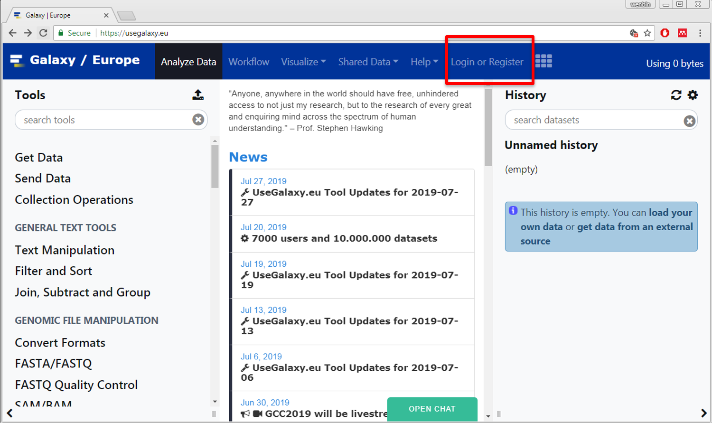
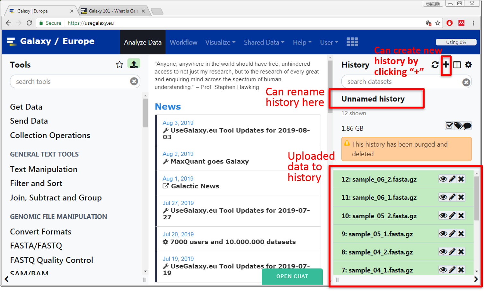
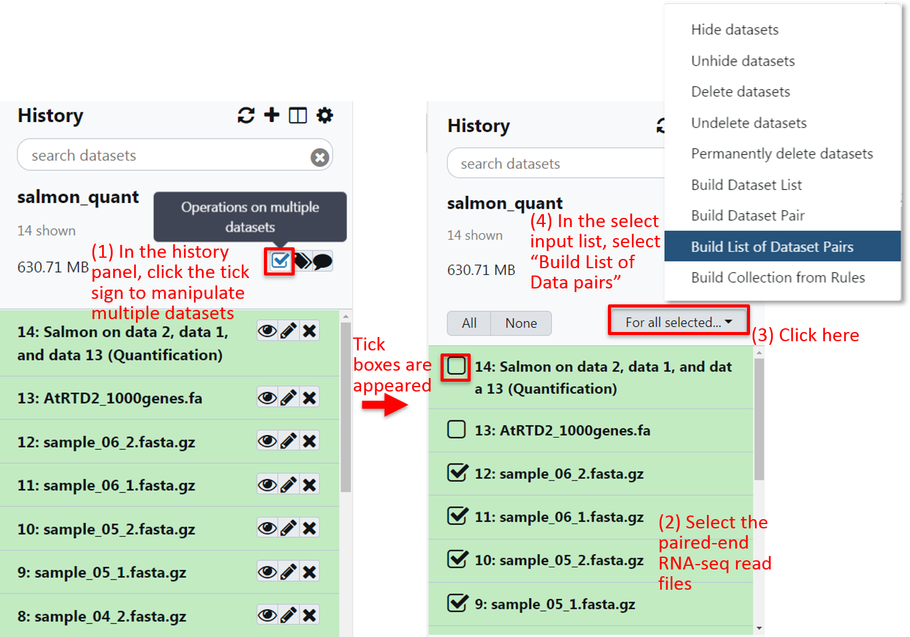
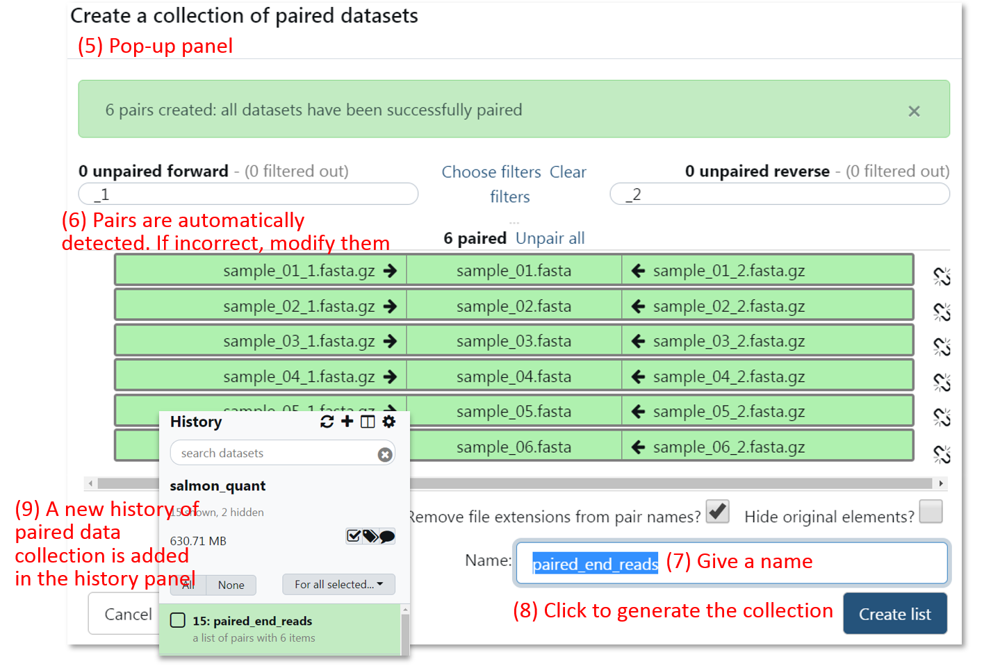
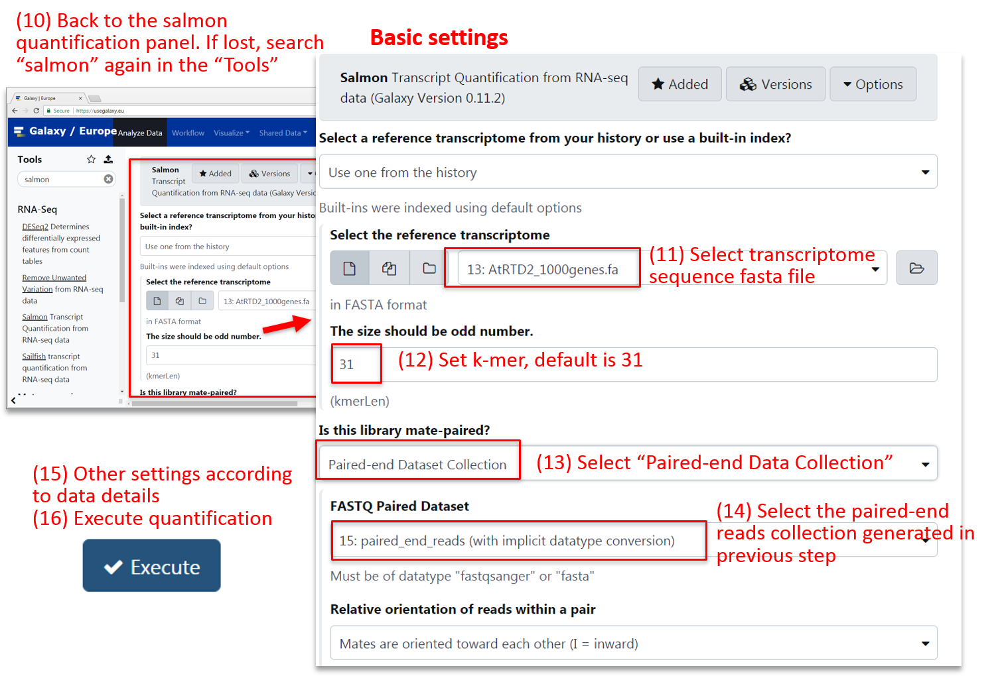
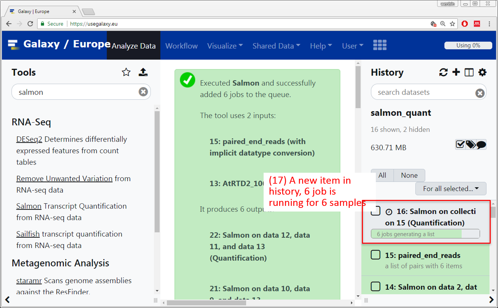
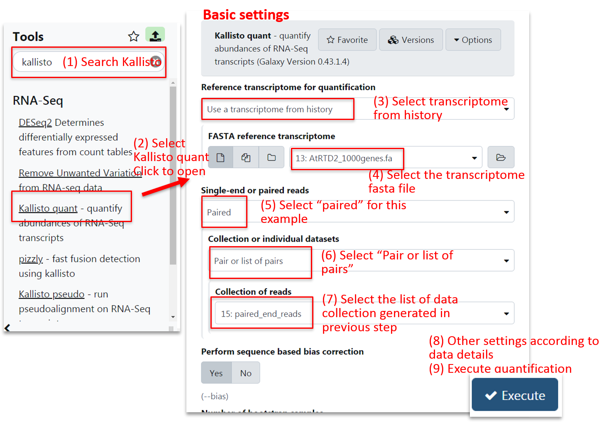
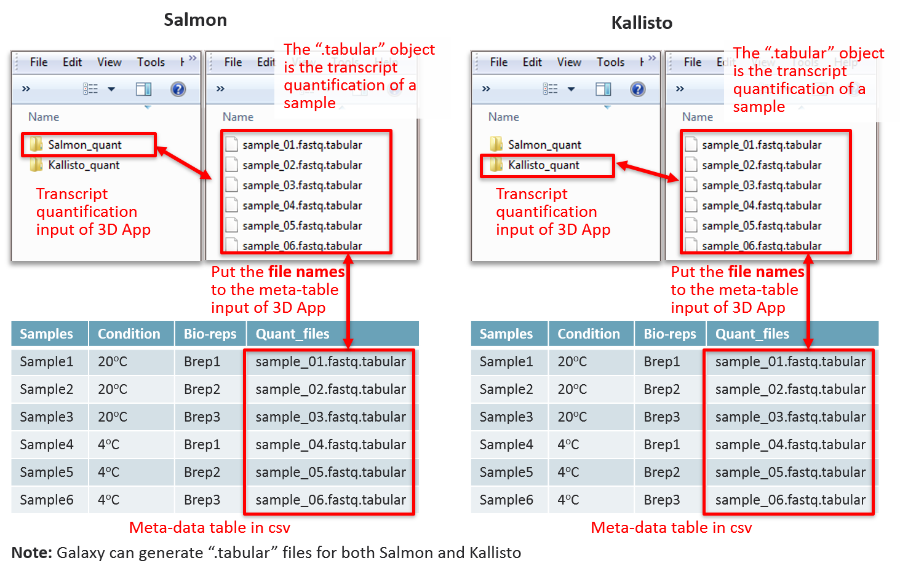

Transcript quantification using Galaxy
==============
<i><h4>Prepare input data for 3D RNA-seq App</h4></i>
<i><h4>Wenbin Guo</h4></i>
<i><h4>28 May 2019</h4></i>
<i><h4>Information & Computational Sciences, James Hutton Institute, Dundee DD2 5DA, UK</h4></i>

-   [Introduction](#introduction)
-   [Example data](#example-data)
-   [Registration of Galaxy Europe](#registration-of-galaxy-europe)
-   [Galaxy user manual](#galaxy-user-manual)
-   [Structure of Galaxy interface](#structure-of-galaxy-interface)
-   [Upload data to Galaxy](#upload-data-to-galaxy)
-   [Salmon quantification](#salmon-quantification)
-   [Kallisto quantification](#kallisto-quantification)
-   [Prepare input files for 3D RNA-seq
    App](#prepare-input-files-for-3d-rna-seq-app)
-   [References](#references)

Introduction
------------

The 3D RNA-seq App takes transcript quantifications from Salmon (Patro
et al., 2017) or Kallisto (Bray et al., 2016) as input for 3D analysis.
The user manuals of command lines to generate quantifications can be
found in:

-   Salmon:
    <a href='https://combine-lab.github.io/salmon/' target='_blank'>https://combine-lab.github.io/salmon/</a>
-   Kallisto:
    <a href='https://pachterlab.github.io/kallisto/about' target='_blank'>https://pachterlab.github.io/kallisto/about</a>

For biologists, we recommend to use the Salmon/Kallisto tool in
web-based graphical user interface **Galaxy Europe**
(<a href='https://usegalaxy.eu/' target='_blank'>https://usegalaxy.eu/</a>)
or other Galaxy resources
(<a href='https://galaxyproject.org/use/' target='_blank'>https://galaxyproject.org/use/</a>),
in which users can perform transcript quantification and download
results by “clicking mouse”.

Example data
------------

**Download link**:

<a href='https://www.dropbox.com/s/k42kvxw9adrrcgp/Galaxy_example_data.zip?dl=0' target='_blank'>https://www.dropbox.com/s/k42kvxw9adrrcgp/Galaxy\_example\_data.zip?dl=0</a>

**Transcriptome**:

-   A subset of AtRTD2 Arabidopsis transcriptome (Zhang et al, 2017)
    with 4679 transcripts from 1000 genes.

**RNA-seq reads**:

-   Two conditions, 20*o**C* vs 4*o**C*.
-   Each has 3 biological replicates.
-   150 bp paired-end reads.

| Samples | Temperature | Bio-reps | Read1         | Read2         |
|---------|-------------|----------|---------------|---------------|
| Sample1 | 20          | Brep1    | sample\_01\_1 | sample\_01\_2 |
| Sample2 | 20          | Brep2    | sample\_02\_1 | sample\_02\_2 |
| Sample3 | 20          | Brep3    | sample\_03\_1 | sample\_03\_2 |
| Sample4 | 4           | Brep1    | sample\_04\_1 | sample\_04\_2 |
| Sample5 | 4           | Brep2    | sample\_05\_1 | sample\_05\_2 |
| Sample6 | 4           | Brep3    | sample\_06\_1 | sample\_06\_2 |

Registration of Galaxy Europe
-----------------------------

<a href='https://usegalaxy.eu/' target='_blank'>https://usegalaxy.eu/</a>

  **Note**: The account needs email activation.

Galaxy user manual
------------------

Galaxy user manual can be found in:
<a href='https://galaxyproject.org/learn/' target='_blank'>https://galaxyproject.org/learn/</a>

Structure of Galaxy interface
-----------------------------

Upload data to Galaxy
---------------------

Galaxy user manual:
<a href='https://galaxyproject.org/tutorials/upload/' target='_blank'>https://galaxyproject.org/tutorials/upload/</a>

Two types of input files are required for transcript quantification
using Salmon:

-   RNA-seq reads in fasta/fastq format.
-   Transcript sequence file in fasta (.fa) format.

  

  

Salmon quantification
---------------------

Input files:

-   Transcriptome sequence fasta file with estension “.fa”.
-   RNA-seq reads files of samples with estension “.fastq.gz” or
    “.fasta.gz”

Salmon documentation:

-   Salmon:
    <a href='https://combine-lab.github.io/salmon/' target='_blank'>https://combine-lab.github.io/salmon/</a>

Im most cases, RNA-sesq data includes many samples and replicates.
Galaxy allows users to build a list of data pairs from RNA-seq data. The
user manual can be found in: Galaxy user manual can be found in:
<a href='https://galaxyproject.org/tutorials/collections/' target='_blank'>https://galaxyproject.org/tutorials/collections/</a>

  

  

  

  

  

  

Kallisto quantification
-----------------------

Input files:

-   Transcriptome sequence fasta file with estension “.fa”.
-   RNA-seq reads files of samples with estension “.fastq.gz” (Kallisto
    in Galaxy does not take “.fasta.gz” format).

Kallisto documentation:

-   Kallisto:
    <a href='https://pachterlab.github.io/kallisto/about' target='_blank'>https://pachterlab.github.io/kallisto/about</a>

  

  

Prepare input files for 3D RNA-seq App
--------------------------------------

The 3D RNA-seq App reads transcript quantifications in “.tabular” files
from Galaxy outputs.

  

References
----------

Bray,N.L., Pimentel,H., Melsted,P., and Pachter,L. (2016) Near-optimal
probabilistic RNA-seq quantification. Nat. Biotechnol., 34, 525–527.

Calixto,C.P.G., Guo,W., James,A.B., Tzioutziou,N.A., Entizne,J.C.,
Panter,P.E., Knight,H., Nimmo,H.G., Zhang,R., and Brown,J.W.S. (2018)
Rapid and Dynamic Alternative Splicing Impacts the Arabidopsis Cold
Response Transcriptome. Plant Cell, 30, 1424–1444.

Guo,W. et al. (2020) 3D RNA-seq: a powerful and flexible tool for rapid and accurate differential expression and alternative splicing analysis of RNA-seq data for biologists. RNA Biol., 00, 1–14.

Patro,R., Duggal,G., Love,M.I., Irizarry,R.A., and Kingsford,C. (2017)
Salmon provides fast and bias-aware quantification of transcript
expression. Nat. Methods, 14, 417–419.
